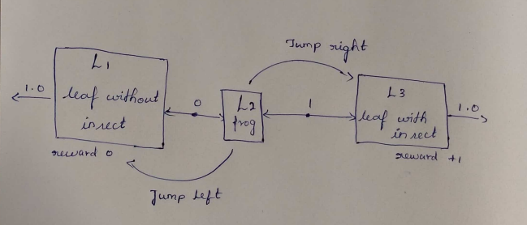
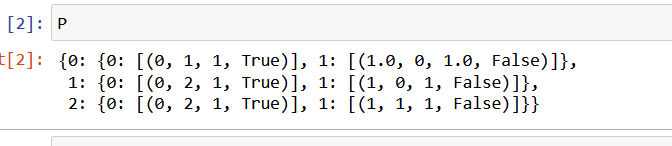

# MDP REPRESENTATION

## AIM:
To represent any one real-world problem in MDP form.

## PROBLEM STATEMENT:

To develope the game application, the role of the agent is to promote the frog into the next level that level having food.

### State Space
{L1,L2,L3}-->{0,1,2}
L1->Level1
L2->Level2
L3->Levvel3

### Sample State
L2->Level2,1

### Action Space
Jump left
Jump right

### Sample Action
Jump right ->Frog gets food

### Reward Function
Reward= 
         +1, if the frog reaches the leaf with food
          0, Otherwise
         

### Graphical Representation

## PYTHON REPRESENTATION:
Register Number:212221240034
Name: Nivetha M
P = {
    0:{
        0: [(0,1,1,True)],
        1: [(1.0,0,1.0,False)]
    },
    1:{
        0: [(0,2,1,True)],
        1: [(1,0,1,False)]
    },
    2:{
        0: [(0,2,1,True)],
        1: [(1,1,1,False)]
    }
}

## OUTPUT:

## RESULT:
Thus the given real world problem is successfully represented in a MDP form.

